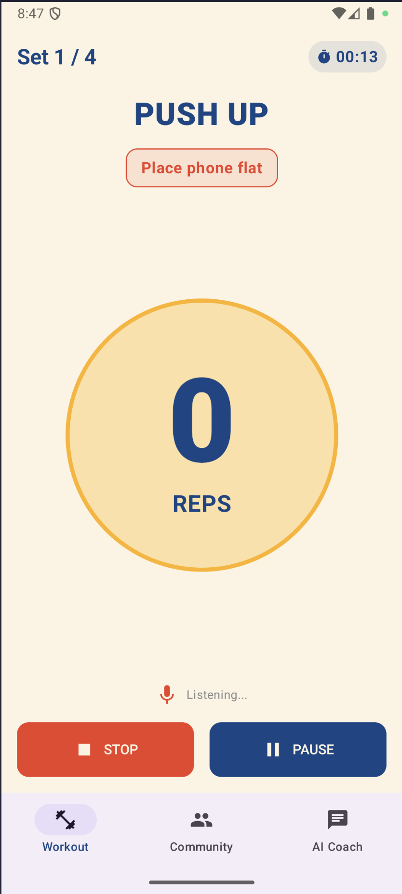
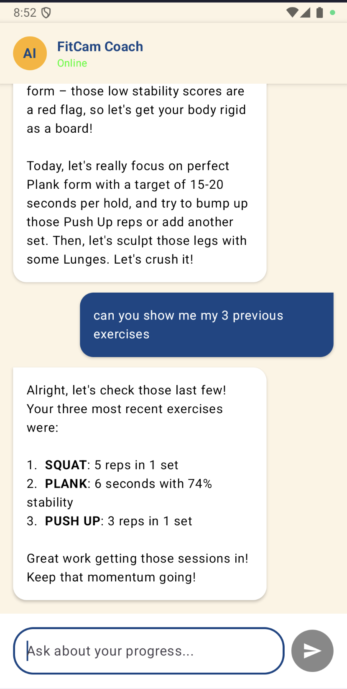

<div align="center">

# FitCam - AI Powered Personal Fitness Trainer

**Your Virtual Personal Trainer in Your Pocket**

[](https://www.android.com/)
[](https://kotlinlang.org/)
[](https://developer.android.com/jetpack/compose)
[](https://firebase.google.com/)
[](https://ai.google.dev/)

</div>

---

## 📱 App Screenshots

<!-- Add your app screenshots here -->

|          Workout Mode           |           AI Coach            |   Community   |
| :-----------------------------: | :---------------------------: | :-----------: |
|  |  | _Coming Soon_ |
|  |  | _Coming Soon_ |

---

## 📖 Table of Contents

- [Overview](#-overview)
- [Key Features](#-key-features)
- [Technology Stack](#-technology-stack)
- [Architecture](#-architecture)
- [Getting Started](#-getting-started)
- [Features in Detail](#-features-in-detail)
- [Project Structure](#-project-structure)
- [Configuration](#️-configuration)

---

## 🎯 Overview

**FitCam** is an innovative Android fitness application that transforms your smartphone into a personal trainer. Leveraging advanced sensor technology and AI-powered coaching, FitCam provides real-time workout tracking, personalized fitness recommendations, and a supportive community platform—all without requiring expensive equipment or gym memberships.

### The Problem

Home workouts are increasingly popular, but users face challenges:

- Difficulty maintaining proper form and technique
- Lack of consistency and motivation
- No personalized guidance or feedback
- Isolation without a workout community

### The Solution

FitCam combines cutting-edge technology to deliver:

- **Sensor-Based Tracking**: Uses your phone's accelerometer and gyroscope to count reps and monitor stability
- **AI Personal Coach**: Google Gemini-powered chatbot that analyzes your workout history and provides personalized recommendations
- **Community Engagement**: Share progress photos with stats overlay and connect with other fitness enthusiasts
- **Voice Control**: Hands-free workout management through voice commands

---

## ✨ Key Features

### 🏋️ Sensor-Based Workout Tracking

Automatically tracks and counts exercises using your phone's built-in sensors:

- **Push-ups**: Rep counting with posture feedback
- **Squats**: Movement detection and form analysis
- **Planks**: Duration tracking with stability scoring

**Metrics Tracked:**

- Repetition count
- Exercise duration
- Stability score (0-100%)
- Set completion
- Session history

### 🤖 AI Personal Assistant

Powered by Google Gemini 2.5 Flash, your AI coach provides:

- Personalized workout recommendations based on history
- Form and technique improvement tips
- Progress analysis and motivation
- Answers to fitness-related questions
- Context-aware responses using your workout data

**Example Conversations:**

- _"What workout should I do today?"_
- _"How can I improve my plank stability?"_
- _"Show me my progress this week"_

### 📷 Community Photo & Video Sharing

Share your fitness journey with the community:

- Capture workout moments with built-in camera
- Automatic stats overlay (Strava-style)
- Upload photos to Firebase Storage
- View community posts and progress
- Motivate and inspire others

**Stats Overlay Includes:**

- Exercise type
- Reps/duration
- Stability score
- Date completed

### 🎙️ Voice Command Control

Hands-free workout management:

- **"Start"** - Begin workout
- **"Pause"** - Pause current session
- **"Stop"** - End workout
- **"Resume"** - Continue after pause

### 📊 Workout History & Analytics

Comprehensive tracking of your fitness journey:

- All workout sessions saved to Firebase
- Historical performance data
- Progress visualization
- AI-powered insights from past workouts

---

## 🛠️ Technology Stack

### Core Technologies

| Technology          | Purpose                      | Version    |
| ------------------- | ---------------------------- | ---------- |
| **Kotlin**          | Primary programming language | Latest     |
| **Jetpack Compose** | Modern Android UI toolkit    | 2024.11.00 |
| **Android SDK**     | Target platform              | API 35     |
| **Material 3**      | Design system                | Latest     |

### Firebase Services

| Service                | Purpose                                   |
| ---------------------- | ----------------------------------------- |
| **Firestore**          | Real-time NoSQL database for workout data |
| **Firebase Storage**   | Cloud storage for community photos/videos |
| **Firebase Analytics** | User behavior tracking                    |

### AI & Machine Learning

- **Google Gemini AI 2.5 Flash**: Conversational AI for personal coaching
- API Integration via `generativeai` SDK (v0.9.0)

### Sensors & Hardware Integration

- **SensorManager API**: Accelerometer and gyroscope data
- **CameraX** (v1.3.4): Modern camera implementation
- **SpeechRecognizer API**: Voice command processing

### Additional Libraries

- **Coil** (v2.6.0): Efficient image loading for Compose
- **Navigation Compose** (v2.9.6): Screen navigation
- **Material Icons Extended**: Rich icon set

---

## 🏗️ Architecture

FitCam follows modern Android architecture patterns:

### MVVM Pattern

```
┌─────────────────────────────────────────────┐
│              UI Layer (Compose)              │
│  WorkoutScreen │ ChatScreen │ CommunityScreen│
└────────────┬────────────────────────────────┘
             │
┌────────────▼────────────────────────────────┐
│         ViewModel Layer                      │
│  WorkoutViewModel │ ChatViewModel │ etc.     │
└────────────┬────────────────────────────────┘
             │
┌────────────▼────────────────────────────────┐
│         Data/Repository Layer                │
│  WorkoutRepository │ SensorSystem │ etc.     │
└────────────┬────────────────────────────────┘
             │
┌────────────▼────────────────────────────────┐
│         Data Sources                         │
│  Firebase │ Sensors │ Gemini API             │
└─────────────────────────────────────────────┘
```

### Key Components

**UI Layer:**

- Jetpack Compose screens
- Material 3 design components
- Bottom navigation

**ViewModel Layer:**

- Business logic
- State management with StateFlow
- Coroutines for async operations

**Data Layer:**

- Repository pattern for data abstraction
- Firebase Firestore operations
- Sensor data processing
- AI API integration

---

## 🚀 Getting Started

### Prerequisites

- **Android Studio** Hedgehog | 2023.1.1 or newer
- **JDK** 11 or higher
- **Android SDK** with API 35
- **Firebase Account** (free tier works)
- **Google AI Studio Account** for Gemini API key

### Installation Steps

#### 1. Clone the Repository

```bash
git clone https://github.com/HazwanAdhikara/fitcam-android.git
cd fitcam-android
```

#### 2. Firebase Setup

1. Go to [Firebase Console](https://console.firebase.google.com/)
2. Create a new project or use existing
3. Add an Android app with package name: `com.example.fitcam`
4. Download `google-services.json`
5. Place it in `app/` directory

**Enable these Firebase services:**

- Firestore Database
- Firebase Storage
- Firebase Analytics (optional)

**Firestore Security Rules:**

```javascript
rules_version = '2';
service cloud.firestore {
  match /databases/{database}/documents {
    match /workouts/{document=**} {
      allow read, write: if true; // For development
      // TODO: Add proper authentication rules
    }
    match /posts/{document=**} {
      allow read, write: if true; // For development
      // TODO: Add proper authentication rules
    }
  }
}
```

#### 3. Get Gemini API Key

1. Visit [Google AI Studio](https://makersuite.google.com/app/apikey)
2. Create a new API key
3. Copy the key

#### 4. Configure API Key

Create or edit `local.properties` in project root:

```properties
sdk.dir=/path/to/your/Android/sdk
apiKey=YOUR_GEMINI_API_KEY_HERE
```

**Important:** This file is gitignored for security.

#### 5. Build & Run

1. Open project in Android Studio
2. Sync Gradle files
3. Connect Android device or start emulator (API 35)
4. Click **Run** ▶️

### Required Permissions

The app requests these permissions:

- 🎤 **RECORD_AUDIO**: Voice commands
- 📷 **CAMERA**: Take workout photos
- 📱 **Sensors**: Access accelerometer/gyroscope (no permission needed)

---

## 📋 Features in Detail

### Workout Mode

#### Supported Exercises

**1. Push-ups**

- Auto rep counting via accelerometer
- Detects up/down movement pattern
- Form feedback based on movement speed
- Calculates stability throughout set

**2. Squats**

- Similar rep detection mechanism
- Monitors vertical movement
- Tracks set completion
- Form quality scoring

**3. Planks**

- Duration-based tracking
- Real-time stability monitoring
- Penalty for excessive movement
- Optimal hold time feedback

#### Workout Flow

```
1. Select Exercise Type →
2. Configure (Sets/Reps/Duration) →
3. Start Workout (voice or button) →
4. Real-time tracking →
5. Rest timer between sets →
6. Session summary →
7. Auto-save to Firebase
```

#### Session Summary

After each workout:

- Total reps/duration
- Sets completed
- Average stability
- Estimated calories burned
- Timestamp
- AI recommendation for next workout

### AI Coach

#### How It Works

1. **Context Building**: AI reads your last 10 workout sessions from Firestore
2. **Personalized Analysis**: Analyzes patterns, frequency, and performance
3. **Smart Responses**: Provides tailored advice based on your history
4. **Motivational Coaching**: Encouraging yet strict feedback

#### Sample Prompts

- "What should I train today?"
- "Am I improving my stability?"
- "Why is my plank time decreasing?"
- "Give me a 7-day workout plan"
- "How many calories have I burned this week?"

#### AI Personality

The FitCam Coach is designed to be:

- ✅ Motivating but honest
- ✅ Data-driven
- ✅ Concise (3 sentences typically)
- ✅ Supportive gym bro tone
- ✅ Form-focused (warns about poor stability)

### Community Sharing

#### Taking Photos

1. Tap camera icon in Community tab
2. Permission granted automatically
3. Capture workout moment
4. Stats overlay applied automatically
5. Upload to Firebase Storage
6. Post appears in community feed

#### Stats Overlay

**For Rep Exercises:**

```
PUSH-UP
50 Reps
5 Sets
03 Dec 2025
```

**For Duration Exercises:**

```
PLANK
120 Seconds
Stability: 85%
03 Dec 2025
```

#### Privacy

- Currently: All posts visible to all users
- Future: Group-based privacy controls
- Photos stored in Firebase Storage
- Metadata in Firestore

---

## 📁 Project Structure

```
fitcam/
├── app/
│   ├── build.gradle.kts          # App-level dependencies
│   ├── google-services.json      # Firebase config (gitignored)
│   └── src/
│       └── main/
│           ├── AndroidManifest.xml
│           ├── java/com/example/fitcam/
│           │   ├── MainActivity.kt
│           │   ├── data/
│           │   │   ├── SensorSystem.kt          # Accelerometer logic
│           │   │   ├── VoiceCommandManager.kt   # Speech recognition
│           │   │   └── WorkoutRepository.kt     # Firebase operations
│           │   └── ui/
│           │       ├── FitCamApp.kt             # Main navigation
│           │       ├── navigation/
│           │       │   └── Screen.kt            # Route definitions
│           │       ├── screens/
│           │       │   ├── workout/
│           │       │   │   ├── WorkoutScreen.kt
│           │       │   │   └── WorkoutViewModel.kt
│           │       │   ├── chat/
│           │       │   │   ├── ChatScreen.kt
│           │       │   │   ├── ChatViewModel.kt
│           │       │   │   └── AIContextHelper.kt
│           │       │   ├── community/
│           │       │   │   ├── CommunityScreen.kt
│           │       │   │   ├── CommunityViewModel.kt
│           │       │   │   ├── CameraScreen.kt
│           │       │   │   └── ImageUtils.kt
│           │       │   └── history/
│           │       │       └── HistoryScreen.kt
│           │       └── theme/
│           │           ├── Color.kt
│           │           ├── Theme.kt
│           │           └── Type.kt
│           └── res/
│               ├── values/
│               └── xml/
├── gradle/
│   └── libs.versions.toml         # Version catalog
├── build.gradle.kts               # Project-level config
├── settings.gradle.kts
└── README.md
```

### Key Files Explained

| File                     | Purpose                                                  |
| ------------------------ | -------------------------------------------------------- |
| `SensorSystem.kt`        | Wraps SensorManager, provides Flow of accelerometer data |
| `VoiceCommandManager.kt` | Handles SpeechRecognizer lifecycle and command parsing   |
| `WorkoutRepository.kt`   | Abstracts Firestore CRUD operations                      |
| `WorkoutViewModel.kt`    | Core workout logic (rep counting, state management)      |
| `ChatViewModel.kt`       | Integrates with Gemini API, manages chat state           |
| `AIContextHelper.kt`     | Builds context prompt from workout history               |
| `CommunityViewModel.kt`  | Handles photo upload and stats overlay                   |

---

## ⚙️ Configuration

### Build Configuration

**App Details:**

- **Package Name**: `com.example.fitcam`
- **Min SDK**: 35 (Android 15)
- **Target SDK**: 35
- **Compile SDK**: 35

### Gradle Dependencies

See `gradle/libs.versions.toml` for version management.

**Major Dependencies:**

```toml
[versions]
kotlin = "2.0.0"
compose = "2024.11.00"
camerax = "1.3.4"
firebase = "34.6.0"

[libraries]
compose-bom = { group = "androidx.compose", name = "compose-bom", version.ref = "compose" }
firebase-bom = { module = "com.google.firebase:firebase-bom", version.ref = "firebase" }
```

### API Configuration

**Gemini API:**

- Model: `gemini-2.5-flash`
- Key stored in `BuildConfig.GEMINI_API_KEY`
- Loaded from `local.properties`

**Firebase:**

- Configuration in `google-services.json`
- Auto-generated during build

---

### Testing Sensors

Since emulators have limited sensor support:

1. Use **Extended Controls** in Android Emulator
2. Navigate to **Virtual Sensors**
3. Simulate accelerometer movement
4. Or use physical device for accurate testing

### Testing Voice Commands

1. Grant microphone permission
2. Start workout
3. Say clearly: "start", "pause", or "stop"
4. Check logcat for "Heard: [command]"

**Tip:** Speak clearly in a quiet environment

---

<div align="center">

**Made with lots of ☕**

_Transform your fitness journey with FitCam!_

</div>
